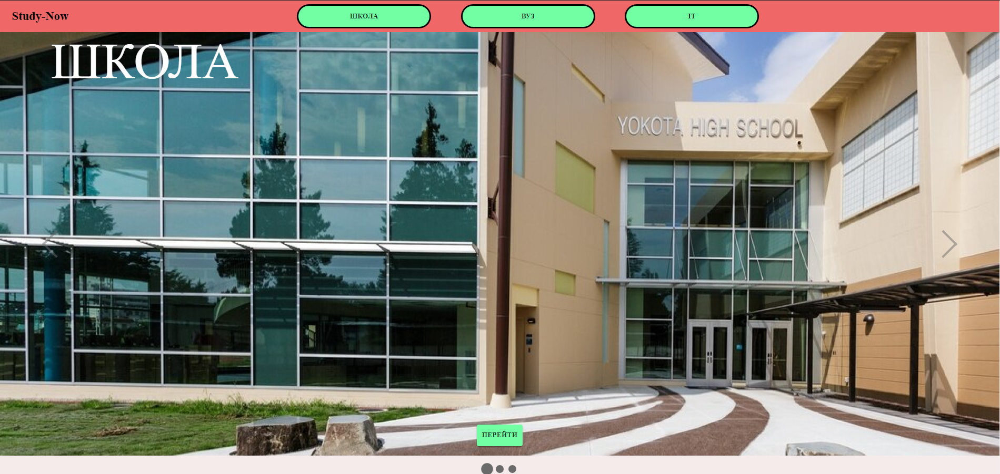
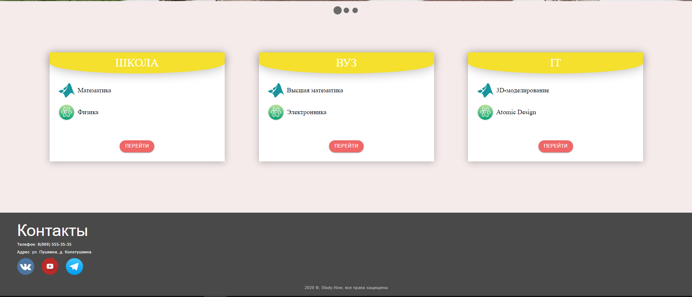
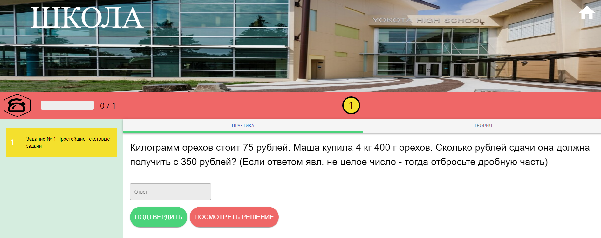
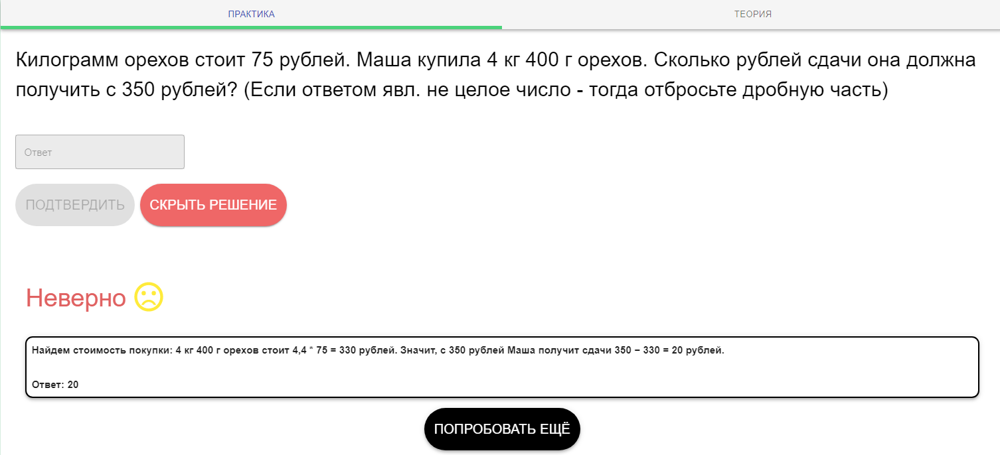

# Название проекта 
Образовательный портал "Study-Now"

# Какую задачу решает ваш проект?
Решает проблему ограниченности в оффлайн использовании приложения после прогрузки нужных компонент страницы. Сайт становится модульным, где не приходится полностью обновлять всю страницу, а лишь обновить её части. Так же в отличии от других сайтов сделана реализация быстрой возможности в тестировании своих знаний и генерации подобных.

# Используемые ЯП и технологий в проекте
1) React.js - для возможности оффлайн управлением приложением, быстрой разработки, отзывчивого интерфейса и для организации модульности
2) Redux - для правильной организации управлениями состоянием приложения поддержкой FLUX архитектуры проекта
3) TypeScript - для типизации и строгово ведения кода
4) Material UI - фреймворк с множеством готовых удобных компонент и с наличием стилевого решения useStyles, Themes и т.п.

# Как проверить работоспособность проекта ?
1) Клонируем репозиторий к себе на рабочую станцию в любое удобное место
2) В корне склонированного репозитория открыть консоль
3) Запустить команду `npm install` для загрузки необходимых для работы проекта пакетов, затем
`npm start`. После этого должен запустится браузер в следующем виде

Данная страница в дальнейшем будет лейдингом сайта.

4) Пройти по url: http://localhost:3000/Home

На данной странице кликабельными являются кнопки "Перейте" и навигационные кнопки в шапке страницы.

5) Переходим на альфа версию страницы курса "Школа", выбрав например в шапке сайта кнопку "Школа"

Здесь можно решить задачу и вписать свой вариант ответа и проверить его на правильность по кнопке "Подтвердить".
Или же воспользоваться кнопкой "Посмотреть решение"

Так же после отображения решения можно сделать автогенерацию того же типа задания, но уже с новоыми входными данными по кнопке "попробовать ещё"
